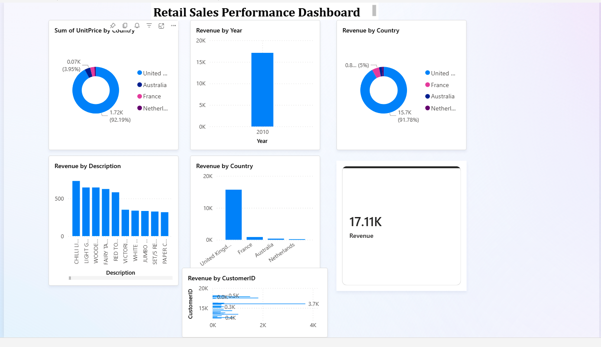

# Retail Sales Analytics Dashboard  
### Azure SQL • Power BI • DAX • Data Modeling

## 📌 Overview
This project demonstrates a complete end-to-end analytics workflow using Azure SQL Database and Power BI. The goal was to transform raw retail sales data into a clean, interactive dashboard using best practices in data modeling, DAX, and visualization.

---

## 🎯 Objectives
- Build a cloud-hosted SQL database  
- Design a star schema for analytics  
- Create DAX measures for revenue insights  
- Develop interactive Power BI visuals  
- Publish and share the dashboard  

---

## 🧱 Architecture
- **Azure SQL Database** – Data storage  
- **Power BI Desktop** – Modeling, DAX, visuals  
- **Star Schema** – Fact + Dimensions  
- **DAX** – Custom measures  
- **Parallels Desktop + Windows 11** – Power BI on Mac  

---

## 📊 Data Model (Star Schema)

### fact_Sales
- Quantity  
- UnitPrice  
- InvoiceDate  
- StockCode  
- CustomerID  

### dim_Product
- StockCode  
- Description  

### dim_Customer
- CustomerID  
- Country  

### dim_Date
- InvoiceDate  
- Year, Month, Day  

**Relationships:**  
- fact_Sales → dim_Product (StockCode)  
- fact_Sales → dim_Customer (CustomerID)  
- fact_Sales → dim_Date (InvoiceDate)  

---

## 🧮 Key DAX Measure

```DAX
Revenue = SUMX('fact Sales', 'fact Sales'[Quantity] * 'fact Sales'[UnitPrice])


####📈 Dashboard Features
Total Revenue KPI

Revenue by Country

Top 10 Products

Top 10 Customers

Monthly Revenue Trend

Revenue Distribution (Pie/Donut)

Date Slicer

🎨 Design
Professional theme

Consistent color palette

Currency formatting

Clean layout and alignment

🚀 Publishing
Built in Power BI Desktop

Published to Power BI Service

Shared via workspace

Screenshots:



